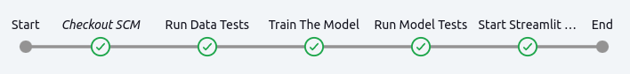
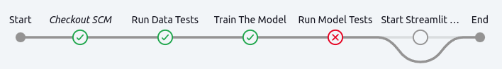

# garbage-clf

`Docker` container pipeline orchestrated by `Jenkins` docker container to test the data, train a model with `PyTorch`, evaluate it and deploy a `Streamlit` web application for garbage recognition.





# Installation and running

## Clone the repository, download the data and make the datasets.
```
git clone https://github.com/molokhovdmitry/garbage-clf.git && \
cd garbage-clf && mkdir data && cd data && mkdir raw processed && \
cd raw && kaggle datasets download -d asdasdasasdas/garbage-classification && \
unzip garbage-classification.zip && rm garbage-classification.zip && \
rm -rf 'garbage classification' && \
mv 'Garbage classification'/'Garbage classification'/* 'Garbage classification' && \
rm -rf 'Garbage classification'/'Garbage classification' && \
cd ../.. && python scripts/make_datasets.py
```

## Create and fill out `.env` file.

## Run Jenkins Docker container.
```
docker run -it -u root \
--env-file .env \
-v $(pwd)/.env:/.env \
-p 8080:8080 -p 50000:50000 \
-v /var/run/docker.sock:/var/run/docker.sock \
-v $(which docker):/usr/bin/docker \
-v models:/models \
-v data:/data \
--name jenkins jenkins/jenkins:jdk17
```

## Setup the pipeline to use `Jenkinsfile` and build.


